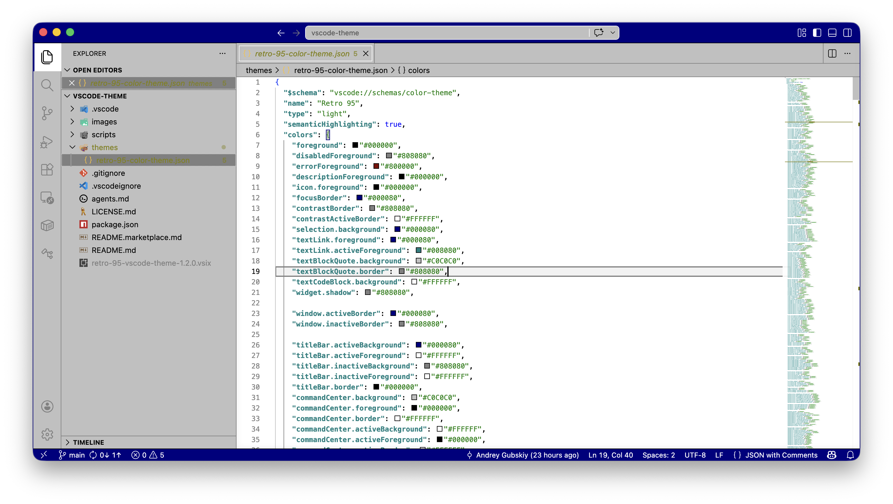
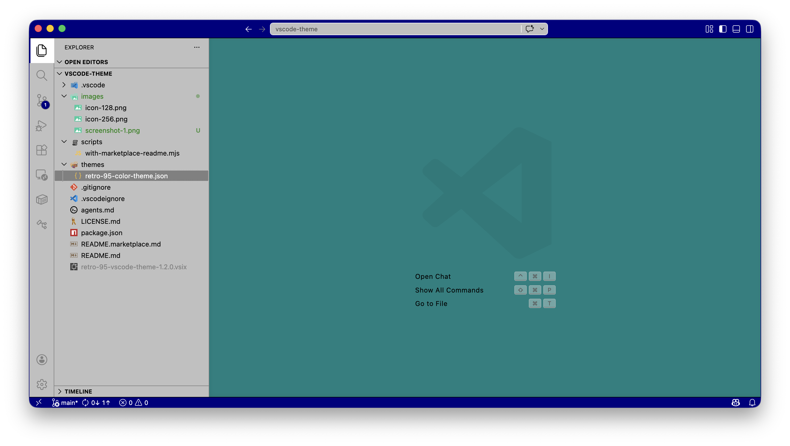

# Retro 95 VS Code Theme

Retro 95 is a Visual Studio Code color theme inspired by classic 90s desktop UIs.

## What You Get

- Navy active bars and focused states (`#000080`)
- Teal desktop-like empty workspace surfaces (`#008080`)
- Gray classic window chrome (`#C0C0C0`)
- White editor background with black text for document-like readability

## Preview

## Install

1. Open Extensions in VS Code.
2. Search for `Retro 95 VS Code Theme`.
3. Click Install.
4. Run `Preferences: Color Theme` and choose `Retro 95`.

## Palette

| Surface | RGB | Hex |
| --- | --- | --- |
| Desktop background | `0, 128, 128` | `#008080` |
| Active title bar | `0, 0, 128` | `#000080` |
| Window chrome | `192, 192, 192` | `#C0C0C0` |
| Shadow | `128, 128, 128` | `#808080` |
| Highlight | `255, 255, 255` | `#FFFFFF` |
| Text | `0, 0, 0` | `#000000` |

## Related Projects

- [Chrome Browser Theme](https://chromewebstore.google.com/detail/ejhoedgmicbdecjikocladnomfbgbmjo?utm_source=item-share-cb)
